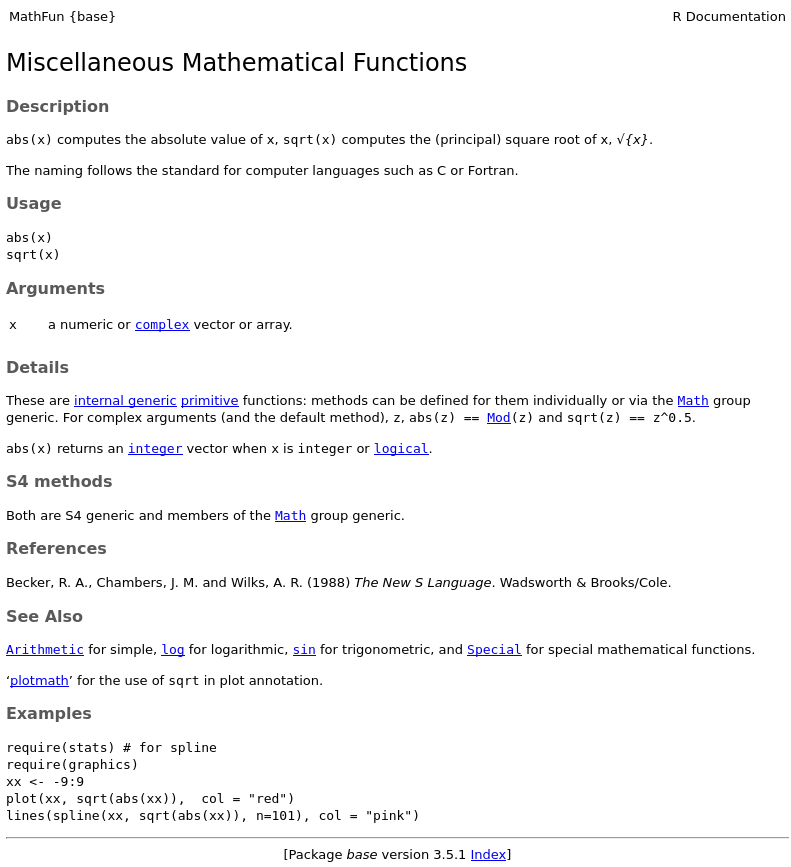
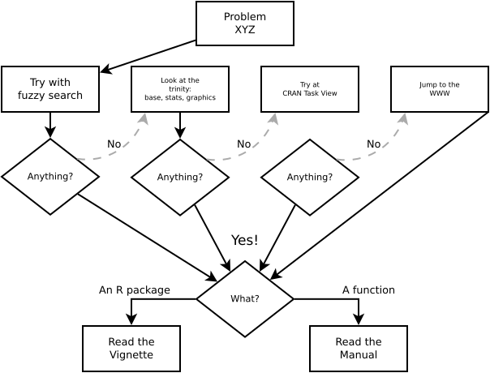

# What is R

<figure>
{.class height="200px"} {.class height="200px"}
<figcaption>From left to right: John Chambers, Robert Gentleman, and Ross Ihaka.</figcaption>
</figure>

* R [@R] is an implementation of the S programming language, which was created in 1976 by **[John Chambers](https://wikipedia.org/wiki/John_Chambers_(statistician))** while at Bell Labs. 

* R itself was created by **[Ross Ihaka](https://wikipedia.org/wiki/Ross_Ihaka)** and **[Robert Gentleman](https://wikipedia.org/wiki/Robert_Gentleman_(statistician))** at the University of Auckland, New Zealand. First release in 1995.

* Currently developed by the **[R Development Core Team](https://www.r-project.org/contributors.html)**, of which Chambers is a member. 

<!-- R is named partly after the first names of the first two R authors and partly as a play on the name of S. -->

(Source [wiki](https://wikipedia.org/wiki/R_(programming_language)))

# The first lesson: Getting help 

In R, if you want to:

*   Know about the `sqrt` function? `?sqrt`, or `help("sqrt")`

*   Know about the `makeCluster` function in the R package `parallel`? `?parallel::makeCluster`, or `help("makeCluster", package="parallel")`

*   Know about the Regular Expressions? `??"Regular Expressions"`, or `help.search("Regular Expressions")`

*   Look at more in deph information about the Matrix package? `vignette(package="Matrix")`

# The first lesson: Getting help (where to find it?)

# The first lesson: Getting help (where to find it?) cont'd

<blockquote class="twitter-tweet" data-lang="en">
The one true <a href="https://twitter.com/hashtag/JavaScript?src=hash&amp;ref_src=twsrc%5Etfw">#JavaScript</a> exception handler. ;) <a href="https://t.co/Zwoi3VlluD">pic.twitter.com/Zwoi3VlluD</a>
&mdash; Jordan Hall (@DivineOmega) <a href="https://twitter.com/DivineOmega/status/695744177557106688?ref_src=twsrc%5Etfw">February 5, 2016</a></blockquote>

*   Take a look at the **rstats** tag on [StackOverflow.com](https://stackoverflow.com/questions/tagged/r)
*   Visit the [r-bloggers.com](https://r-bloggers.com) website
*   Read one of the dozens of online free books about R created with the [R package bookdown](https://cran.r-project.org/package=bookdown) at
    [bookdown.org](https://bookdown.org/)

# The first lesson: Getting help (How to read it?)

# The first lesson: Getting help (a mental model)

<figure>

<figcaption>My own personal way of looking for R-based solutions to my problems (in science... of course)</figcaption>
</figure>

# References